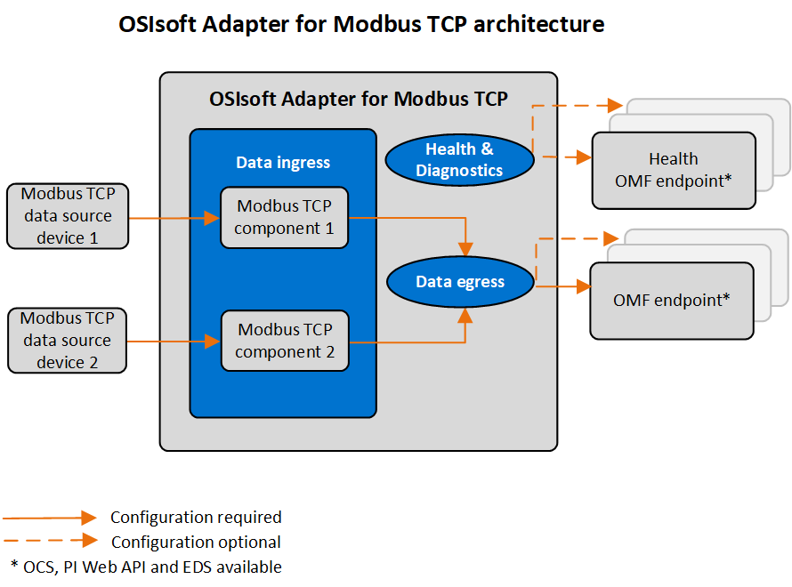

# PI Adapter for Modbus TCP overview

PI Adapter for Modbus TCP is a data-collection component that transfers time-series data from source devices to OMF endpoints in OSIsoft Cloud Services or PI Servers. Modbus TCP is a commonly available communication protocol used for connecting and transmitting information between industrial electronic devices. The adapter can connect to any device that uses the Modbus TCP communication protocol.

The adapter is installed with a download kit obtained from the OSIsoft Customer Portal and works on devices running either Windows or Linux operating systems.

All functions of the adapter are configured using REST API. The configurations are stored in JSON files. For data ingress, an adapter component must be defined in the system components configuration for each device to which the adapter will connect. Each adapter component is then configured with the connection information for the device and the data to collect. For data egress, configuration is needed to specify destinations for the data, including security for the outgoing connection. Additional configurations are available to egress health and diagnostics data, add buffering configuration to protect against data loss, and record logging information for troubleshooting purposes.

Once the adapter is configured and sending data, administration functions are used to manage the adapter or individual ingress components of the adapter. Health and diagnostics functions monitor the status of connected devices, adapter system functions, the number of active data streams, the rate of data ingress, the rate of errors, and the rate of data egress.

The EdgeCmd utility is an OSIsoft proprietary command line tool that is used to configure and administer an adapter on both Linux and Windows operating systems. It is installed separately from the adapter.
